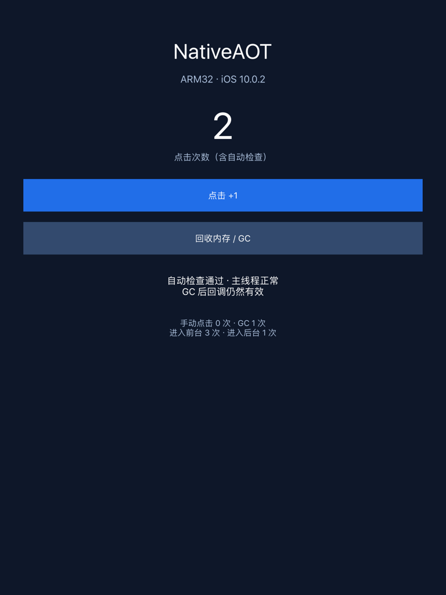
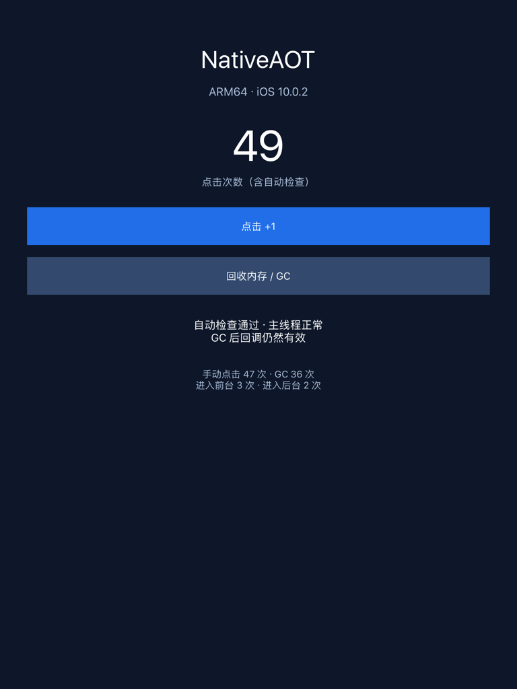

# 2026-09-09：C# UIKit 应用真机验证

普通 `.NET 10` 项目已生成可从桌面打开的 ARM32、ARM64 UIKit 应用，在 **iPad mini 4 / iOS 10.0.2（14A456）** 上完成启动、显示、按钮、GC、主线程和前后台验证。**最低版本记录为 iOS 7.0，尚未验证真实 iOS 7。**

## 实现与产物

应用代码只引用普通 .NET 基础库，通过 P/Invoke 调用 UIKit、Foundation 和 Objective-C runtime；没有 macios 托管绑定。`UIApplicationMain` 创建动态注册的代理类，其生命周期和按钮 action 由 `UnmanagedCallersOnly` 静态入口处理。C# 创建窗口、UIViewController、UILabel 和 UIButton，原生视图层次管理子视图的所有权。

消息发送使用明确的函数签名。`CGFloat` 在 ARM32/ARM64 分别使用 float/double；ARM32 的 CGRect 返回使用 `objc_msgSend_stret`，ARM64 使用普通 `objc_msgSend`。主线程调用 UIKit，工作线程显式建立 autorelease pool，并通过 `performSelectorOnMainThread` 返回主线程。相关接口与最低版本根据本地 iOS 9.3 SDK 头文件核对；消息发送规则参考 [Apple 文档](https://developer.apple.com/documentation/ObjectiveC/objc_msgSend)。

`build-uikit-probe.py` 调用既有通用发布入口，再由 `package-app.py` 生成 Info.plist、代码绘制的图标、`.app`、`.ipa` 和系统目录安装归档，并生成 ad-hoc SHA-1/SHA-256 签名。两个归档通过 ZIP/Plist 检查，应用签名通过 `codesign --verify --strict`。

## 真机结果

| 检查 | ARM32 | ARM64 |
|---|---|---|
| 桌面启动、窗口与文字 | 通过 | 通过 |
| 自动 UIControl action、GC 后继续回调 | 通过 | 通过 |
| 工作线程回到 UIKit 主线程 | 通过 | 通过 |
| 用户手动点击和 GC | 初版记录 32 次手动点击、9 次 GC | 最终版记录 47 次手动点击、36 次 GC |
| 最终版前后台切换 | 进入前台 3 次、后台 1 次 | 进入前台 3 次、后台 3 次 |
| 已安装可执行文件读回 | SHA-256 一致 | SHA-256 一致 |

GC 数包含启动自动检查的一次。最终 ARM32 在一次重新启动后计数复位，保存的最终快照是自动检查后的 2 次计数；它的手动触摸证据来自日志路径分离前的初版，不能把初版计数算成最终进程计数。最终两种架构的 `main`、`smoke`、`worker` 均为 True，`error` 为空。

两种应用均取得用户手动操作记录，设备 `uiopen` 也成功通过专用 URL scheme 启动和切换它们。验证期间检索了匹配应用名的崩溃报告，未获取到应用崩溃报告。GUI 应用持续运行，因此没有把安装脚本退出 0 当成 GUI 应用退出码。

### ARM32 最终窗口

### ARM64 最终窗口

快照由应用自己的窗口绘制得到。ARM64 快照在最后一次进入后台前保存，因此图中后台次数比随后采集的状态文件少 1。

## 安装与设备差异

设备上的应用位于 `/Applications/NativeAOTUIKit32.app` 和 `NativeAOTUIKit64.app`，使用系统现有 `uicache` 注册。应用 Home 在这台设备上为 `/var/mobile`；两个架构的结果分别保存在自己的 Documents 子目录，避免相互覆盖。System 类型应用的 House Arrest 查询返回 InstallationLookupFailed，本轮通过已有 Filza root 测试会话读取应用自己的结果文件。

使用方法见 [README](../README.md#uikit-应用与-app-打包)。没有安装常驻测试服务。临时会话 v9 已停止。测试目录从 388 项、129984 KiB 整理到 `UIKit` 和 `Results` 两个目录，共 1904 KiB；移除了旧探针和任务文件。329 项历史诊断文本归档为 27231 字节，已下载到 Mac 并逐项解包校验。最新安装包、安装脚本、状态、日志和快照仍保留在设备。

## 最终签名文件

| 架构 | Bundle ID | 可执行文件 SHA-256 |
|---|---|---|
| ARM32 | `org.nativeaot.legacy.uikit.arm32` | `5c05ca335da19fd8be50911c967e4052412cbe378e553cc72860d748e9ead79f` |
| ARM64 | `org.nativeaot.legacy.uikit.arm64` | `98dd3d83c8f1013258411f49f90f3f7cea1582a10ce905d7c5fa458521800574` |

本地证据：

- `artifacts/log/legacy-ios/uikit-final-arm32-status.txt` / `uikit-final-arm64-status.txt`。
- 同目录 `uikit-final-arm32-events.log` / `uikit-final-arm64-events.log`。
- `ipad-uikit-initial-status.txt` / `ipad-uikit-initial-events.log`：ARM32 初版手动测试。
- `artifacts/legacy-ios/uikit/device-results.json`：状态及读回校验。
- 各架构 `package/app-manifest.json`：打包输入和签名文件哈希。
- `artifacts/log/legacy-ios/uikit-history-before-cleanup.tar.gz`：历史诊断文本备份。
- 同目录 `uikit-cleanup-cleanup-summary.txt`、`uikit-cleanup-size-after.txt`、`uikit-cleanup-session-status.txt`：清理与会话结束证据。

应用只做最小 UIKit 宿主演示。iPhone 布局、横屏、开发者证书安装、完整绑定/复杂 Objective-C 对象生命周期和 iOS 7 真机仍待独立验证。
